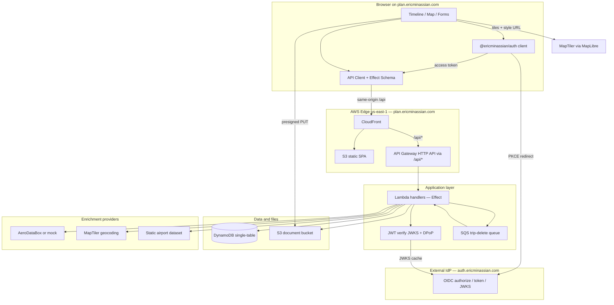
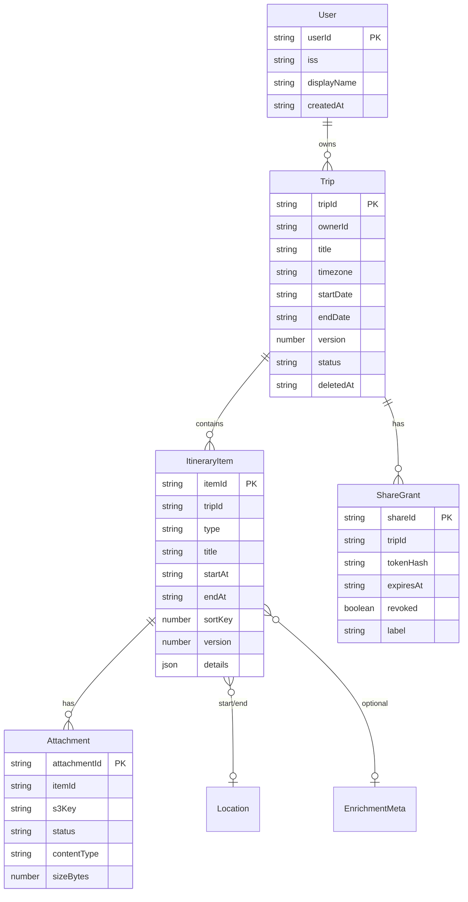

# TripPlan — Modern Trip Planning Platform

| Field | Value |
|-------|--------|
| **Title** | TripPlan: Feature-Rich Trip Itinerary Platform |
| **Author** | Eric Minassian |
| **Date** | 2026-07-11 |
| **Status** | Draft |
| **Version** | 0.5 |

---

## Overview

TripPlan is a greenfield web application for building, visualizing, and sharing travel itineraries. Users enter flights, trains, hotels, ground transport, activities, and tickets into a single day-grouped timeline; the system enriches items via server-side adapters (flight number + date → times and airports; place search → address and geo), attaches supporting documents, and renders the journey on an interactive map. Owners retain sole edit rights; collaborators receive time-bounded, revocable read-only access via share links that never require an account.

The stack is TypeScript end-to-end: React + Vite + Tailwind + shadcn/ui on the frontend, Effect-based HTTP APIs on AWS (Lambda + API Gateway + DynamoDB + S3) in **us-east-1**, infrastructure as code with AWS CDK, and Playwright for E2E tests—managed with pnpm workspaces. **Owner auth** is the existing first-party OIDC provider at [auth.ericminassian.com](https://auth.ericminassian.com) ([eric-minassian/auth](https://github.com/eric-minassian/auth)) via `@ericminassian/auth`—not Cognito. Production host: **plan.ericminassian.com**. Flight enrichment live provider: **AeroDataBox** (mock-first). Places + map tiles: **MapTiler only**. The product targets a superior UX versus legacy tools like TripIt: fast progressive web app, suggest-then-confirm enrichment, clean share viewer, and map storytelling that makes multi-city trips spatially legible.

---

## Background & Motivation

### Current state of the market

Tools such as TripIt excel at email-forward ingestion but often feel dated: cluttered UI, limited map storytelling, weak mobile web experience, and opaque data ownership. Power travelers and trip organizers still stitch together Google Docs, spreadsheets, chat threads, and PDF folders. Pain points include:

- **Fragmented data entry**: confirmation emails, airline apps, hotel portals, and activity bookings never land in one structured place.
- **Manual retyping**: flight numbers, gate times, hotel addresses, and booking references are copied by hand and go stale.
- **Weak sharing**: “export PDF” or account invites are heavyweight; guests cannot open a clean read-only itinerary without signing up.
- **Poor spatial mental model**: lists of hotels and activities without a coherent map of *where the days live*.
- **Document scatter**: tickets live in email and camera rolls, disconnected from the itinerary item they belong to.

### Why build now

Browser map SDKs, flight-status APIs, and serverless TypeScript stacks make a polished single-owner / multi-viewer itinerary product feasible without a large ops team. Effect gives typed errors and composable integrations for flaky third-party enrichment. CDK keeps infra reproducible from day one.

---

## Goals & Non-Goals

### Goals (v1)

1. **Complete itinerary modeling** for flights, trains, hotels, transportation, activities, generic tickets, notes, and custom items.
2. **Owner-only edits** with **read-only sharing** via capability links (expiry + revoke in v1; revoke effective on the next request).
3. **Map view** showing item locations, day filters, and route sketches between sequential points (items without geo stay timeline-only).
4. **Smart enrichment** starting with flights (number + date) and places (hotels/activities); extensible adapters; always user-confirmed.
5. **Per-item document attachments** (PDF, images; size-limited) stored privately with signed access for owner and share viewers.
6. **Modern UX**: responsive SPA, day-grouped timeline, keyboard-friendly forms, optimistic UI where safe, print-friendly share view, owner “Download JSON” export.
7. **Solid foundation**: auth, **per-owner isolation**, observability, automated tests, incremental PR-friendly architecture.

### Non-Goals (v1)

- Multi-editor collaborative editing / CRDT real-time co-authoring.
- Org/workspace/team tenancy (B2B multi-tenant workspaces).
- Automatic email parsing / Gmail or Outlook inbox scanning (future phase; model leaves an `IngestionSource` hook).
- Native iOS/Android apps (responsive PWA is sufficient for v1).
- In-app booking or payments (itinerary layer, not an OTA).
- Offline-first full edit with local sync (optional offline cache of share views is stretch).
- Multi-currency expense tracking / budgeting as a first-class product.
- Live gate / delay push notifications beyond on-demand enrichment refresh.
- Password-protected share links (phase 1.1; v1 uses high-entropy tokens + expiry + revoke only).
- Live train schedule enrichment (v1.1; trains are full first-class items with manual entry + place search).
- Trip cover images (defer; no upload flow in v1).
- Concurrent multi-share-session cookies in one browser (v1: one active share session cookie).
- Email magic-link / SES invite for shares (v1: **copy-paste capability URLs only**).
- Virus / malware scanning of uploads (post-GA; residual risk accepted).
- Amazon Cognito (or other third-party IdP) for owner auth—use personal OIDC at auth.ericminassian.com.
- Google Places or dual place vendors in v1 (MapTiler only).

---

## Proposed Design

### High-level architecture



**Topology decision:** SPA and API share one public host — **production `plan.ericminassian.com`** (CloudFront in **us-east-1**). Paths `/api/*` proxy to API Gateway; everything else is the SPA. This enables first-party cookies for share sessions (`SameSite=Lax`, `Secure`, `HttpOnly`) on the plan host. Owner identity is established via redirect to the external IdP **auth.ericminassian.com** (same parent domain family `*.ericminassian.com`); access tokens are presented as `Authorization: Bearer` (and DPoP when bound) to the TripPlan API—not Cognito.

### Owner authentication (external auth stack)

TripPlan **does not** provision Cognito or any built-in user pool. Owner auth is the personal OIDC provider:

| Item | Value |
|------|--------|
| Repo | [github.com/eric-minassian/auth](https://github.com/eric-minassian/auth) |
| Issuer | `https://auth.ericminassian.com` (discovery `/.well-known/openid-configuration`) |
| Auth UX | Passkeys-only (WebAuthn); no passwords; IdP holds **no email** |
| Web SDK | `@ericminassian/auth` — `/client`, `/react` |
| Server SDK | `@ericminassian/auth/server` — `createAuthVerifier({ audience })` |
| Flow | Authorization Code + PKCE (S256); public client (`token_endpoint_auth_method: none`) |
| Identity key | JWT **`sub`** (UUIDv7); key local rows on `(iss, sub)` only—never `nickname` |
| Scopes | `openid profile offline_access` (no `email` scope/claim—do not require email) |
| Display name | `nickname` from profile (mutable, non-unique); store as `displayName` |
| Tokens | Access token in memory; refresh in sessionStorage via SDK; DPoP sender-constrained by default |
| Production RP | `https://plan.ericminassian.com` |
| OIDC client | Register in auth repo `config/clients.json` (e.g. `client_id: "plan"`) with redirect URIs, allowed origins, post-logout URIs, optional back-channel logout |

**Client registration (auth repo — not TripPlan CDK):**

```json
{
  "client_id": "plan",
  "client_name": "TripPlan",
  "redirect_uris": [
    "https://plan.ericminassian.com/auth/callback",
    "http://localhost:5173/auth/callback"
  ],
  "post_logout_redirect_uris": [
    "https://plan.ericminassian.com/",
    "http://localhost:5173/"
  ],
  "allowed_origins": [
    "https://plan.ericminassian.com",
    "http://localhost:5173"
  ],
  "scopes": ["openid", "profile", "offline_access"]
}
```

**API validation (resource server):**

1. Owner routes require `Authorization: Bearer <access_token>` (+ `DPoP` header when token has `cnf.jkt`).
2. Lambda uses `createAuthVerifier({ audience: "plan" })` from `@ericminassian/auth/server` (JWKS from issuer; cache keys). Mode `dpop: { mode: "auto" }` so bound tokens cannot be downgraded to bare bearer.
3. Prefer **in-Lambda verification** (Effect middleware) for DPoP proof binding to method/URL; optionally front with API Gateway JWT authorizer for signature-only checks and still re-verify DPoP in Lambda—do not rely on Cognito JWT authorizer.
4. On success, set `ownerId = claims.sub`. `GET /me` upserts profile with `displayName` from `nickname` when present.
5. **AuthProvider boundary** in code: `OwnerAuth` service interface (`requireOwner(): Effect<OwnerPrincipal, Unauthorized>`) so tests can inject a mock principal without the IdP.

```typescript
// packages/api — conceptual
import { createAuthVerifier } from "@ericminassian/auth/server"

const verifier = createAuthVerifier({
  audience: "plan", // must match client_id / token aud
  // issuer defaults to https://auth.ericminassian.com per SDK
})

// In owner middleware: authenticateRequest(request) → claims.sub
```

```tsx
// packages/web — conceptual
import { createAuthClient } from "@ericminassian/auth/client"
import { AuthProvider } from "@ericminassian/auth/react"

const client = createAuthClient({
  clientId: "plan",
  redirectUri: `${window.location.origin}/auth/callback`,
})
```

### Dev & Test Environment

| Concern | v1 recommendation |
|---------|-------------------|
| **AWS region** | **us-east-1** for all TripPlan stacks (aligned with auth infra). |
| **AWS target** | Real `dev` stage in a shared AWS account (not LocalStack for DDB). GSI, TTL, S3 presign match prod. |
| **DynamoDB** | Real table from DataStack; integration tests against `dev` or ephemeral CDK stack. Prefer real DynamoDB over DynamoDB Local. |
| **Local API** | `pnpm --filter api dev` + Vite `server.proxy['/api']` → local API. Share cookies: `Secure` off only on localhost. |
| **Owner auth (local)** | Point `@ericminassian/auth` at production IdP `https://auth.ericminassian.com` **or** local auth stack (`auth.localhost:5173` per auth repo). Register localhost redirect on the `plan` OIDC client. |
| **Owner auth (prod)** | `https://plan.ericminassian.com/auth/callback` registered on client `plan`. |
| **Secrets / e2e** | CI OIDC → AWS role. Playwright: real passkey is hard—use API integration tests with **forged test JWTs** against a test verifier key **or** IdP test harness if available; share flows can run without owner auth after seed trip via admin test helper. Enrichment: `MockFlightProvider` in CI (`enrichment.flight.live=false`). |
| **Seed** | `pnpm --filter api seed`: demo trip + mock flight fixtures. |
| **Unit tests** | Domain pure functions + schema tests (no AWS). |
| **Integration tests** | `@tripplan/api` access-pattern suite; gated on `TRIPPLAN_IT_TABLE` / credentials. |

### Monorepo layout (pnpm workspaces)

```
tripplan/
  package.json
  pnpm-workspace.yaml
  packages/
    domain/          # Pure types, Effect Schema, domain logic, airport types
    api/             # HTTP API (Effect + Lambda adapters)
    web/             # React + Vite + Tailwind + shadcn
    infra/           # AWS CDK app
    e2e/             # Playwright tests
  tooling/
    eslint-config/
    tsconfig/
  data/
    airports/v1.json # Versioned IATA→geo dataset (also published to S3)
```

| Package | Responsibility |
|---------|----------------|
| `@tripplan/domain` | Entities, value objects, discriminated item schemas, share-token rules, error envelope, pure day-bucketing, Instant normalize |
| `@tripplan/api` | Route handlers, **authz matrix middleware**, enrichment services, DynamoDB/S3 repositories, delete worker |
| `@tripplan/web` | SPA: `@ericminassian/auth` integration, trip editor, map, share viewer |
| `@tripplan/infra` | CDK stacks: foundation, data, API, web, observability (**no Cognito/AuthStack user pool**) |
| `@tripplan/e2e` | Critical paths: create trip, enrich (mock), share session, upload doc |

### Domain model

Core aggregates center on **Trip** (owned by a single user) containing **ItineraryItems**, **ShareGrants**, and **Attachments**. Isolation is **per-owner** (`ownerId ===` OIDC `sub` from auth.ericminassian.com), not org tenancy.



`Trip.status`: `active` | `deleting` | `deleted` (soft). Share and owner GET reject `deleting`/`deleted` appropriately (410 when deleted; 409/503 optional while deleting).

#### Timezone model (decided)

| Concern | Rule |
|---------|------|
| Storage | All `startAt` / `endAt` stored as **canonical Instant**: ISO-8601 with offset or `Z`, **second precision** (no fractional seconds on write). |
| Parse / normalize | Accept RFC 3339 variants from clients and providers (optional fractional seconds, `Z` or `±HH:MM`). `normalizeInstant(input)` parses via allowlist, then formats to canonical form. Reject zoneless local datetimes. |
| Unit tests | Provider fixtures + `Date.toISOString()` round-trip through `normalizeInstant`. |
| Optional display zone | `startTimeZone` / `endTimeZone` IANA strings for labels only. |
| Trip timezone | `Trip.timezone` (IANA) is the **default day-bucket zone**. |
| Day bucketing | Convert each item’s `startAt` to trip timezone civil date → `Day N`. Items without timestamps → unscheduled bucket. |
| Cross-zone flights | Store both legs with their offsets; absolute instants drive ordering. |
| Date-only hotel spans | `details.timePrecision: "date"`; UI may hide clock times when midnight. |

#### Itinerary item types (discriminated union)

Shared validation lives in `@tripplan/domain` and is used by **both** web forms and API decode—no `S.Unknown` for `details`.

```typescript
// packages/domain/src/itinerary-item.ts
import { Schema as S } from "effect"

export const GeoPoint = S.Struct({
  lat: S.Number.pipe(S.between(-90, 90)),
  lng: S.Number.pipe(S.between(-180, 180)),
  label: S.optional(S.String),
  placeId: S.optional(S.String),
  address: S.optional(S.String),
  timezone: S.optional(S.String), // IANA
})

/** Canonical stored form after normalizeInstant (second precision). */
export const Instant = S.String.pipe(
  S.pattern(/^\d{4}-\d{2}-\d{2}T\d{2}:\d{2}:\d{2}(Z|[+-]\d{2}:\d{2})$/)
)

/** Input accept list before normalize (fractional seconds allowed). */
export const InstantInput = S.String // validated in normalizeInstant, not bare regex alone

export const EnrichmentMeta = S.Struct({
  provider: S.String,
  fetchedAt: Instant,
  confidence: S.optional(S.Number),
  rawRef: S.optional(S.String),
})

const ItemBase = {
  itemId: S.String,
  tripId: S.String,
  title: S.String.pipe(S.minLength(1), S.maxLength(200)),
  startAt: S.optional(Instant),
  endAt: S.optional(Instant),
  startTimeZone: S.optional(S.String),
  endTimeZone: S.optional(S.String),
  startLocation: S.optional(GeoPoint),
  endLocation: S.optional(GeoPoint),
  /** Free-form notes on any item type. For type:"note", this IS the note body. */
  notes: S.optional(S.String.pipe(S.maxLength(5000))),
  /**
   * Owner-facing PNR / confirmation shown on the card.
   * Prefer details.bookingReference for provider-specific codes when both exist;
   * confirmationCode is the single UI “Confirmation #” field when only one is needed.
   */
  confirmationCode: S.optional(S.String.pipe(S.maxLength(64))),
  sortKey: S.Number,
  version: S.Number,
  enrichment: S.optional(EnrichmentMeta),
  createdAt: Instant,
  updatedAt: Instant,
}

export const FlightDetails = S.Struct({
  airlineCode: S.optional(S.String),
  airlineName: S.optional(S.String),
  flightNumber: S.String,
  departureAirport: S.optional(S.String),
  arrivalAirport: S.optional(S.String),
  departureTerminal: S.optional(S.String),
  arrivalTerminal: S.optional(S.String),
  bookingReference: S.optional(S.String), // airline PNR if distinct from confirmationCode
  seat: S.optional(S.String),
  cabin: S.optional(S.String),
  operatedBy: S.optional(S.String),
})

export const HotelDetails = S.Struct({
  propertyName: S.String,
  checkInTime: S.optional(S.String),
  checkOutTime: S.optional(S.String),
  address: S.optional(S.String),
  phone: S.optional(S.String),
  bookingReference: S.optional(S.String),
  roomType: S.optional(S.String),
  timePrecision: S.optional(S.Literal("date", "datetime")),
})

export const TrainDetails = S.Struct({
  operator: S.optional(S.String),
  trainNumber: S.optional(S.String),
  departureStation: S.optional(S.String),
  arrivalStation: S.optional(S.String),
  coach: S.optional(S.String),
  seat: S.optional(S.String),
  bookingReference: S.optional(S.String),
})

export const TransportDetails = S.Struct({
  mode: S.Literal("car", "taxi", "rideshare", "bus", "ferry", "other"),
  provider: S.optional(S.String),
  pickupInstructions: S.optional(S.String),
})

export const ActivityDetails = S.Struct({
  category: S.optional(S.String),
  venueName: S.optional(S.String),
  bookingUrl: S.optional(S.String),
  bookingReference: S.optional(S.String),
})

export const TicketDetails = S.Struct({
  issuer: S.optional(S.String),
  ticketType: S.optional(S.String),
  validFrom: S.optional(Instant),
  validTo: S.optional(Instant),
})

/** Note items: body lives in base `notes`; details is empty struct. */
export const NoteDetails = S.Struct({})

export const CustomDetails = S.Struct({
  fields: S.optional(
    S.Record({
      key: S.String.pipe(S.maxLength(64)),
      value: S.String.pipe(S.maxLength(200)),
    }).pipe(S.filter((r) => Object.keys(r).length <= 20, { message: () => "max 20 custom fields" }))
  ),
})

export const ItineraryItem = S.Union(
  S.Struct({ ...ItemBase, type: S.Literal("flight"), details: FlightDetails }),
  S.Struct({ ...ItemBase, type: S.Literal("train"), details: TrainDetails }),
  S.Struct({ ...ItemBase, type: S.Literal("hotel"), details: HotelDetails }),
  S.Struct({ ...ItemBase, type: S.Literal("transport"), details: TransportDetails }),
  S.Struct({ ...ItemBase, type: S.Literal("activity"), details: ActivityDetails }),
  S.Struct({ ...ItemBase, type: S.Literal("ticket"), details: TicketDetails }),
  S.Struct({ ...ItemBase, type: S.Literal("note"), details: NoteDetails }),
  S.Struct({ ...ItemBase, type: S.Literal("custom"), details: CustomDetails }),
)
export type ItineraryItem = S.Schema.Type<typeof ItineraryItem>
```

#### Create / Update DTOs

```typescript
// Server-assigned fields omitted on create; type immutable on PATCH.
export const CreateItineraryItem = /* union of type + details + optional times/locations/notes/confirmationCode/enrichment */
// UpdateItineraryItem: same shape but all fields optional EXCEPT type must be absent
// (sending type → 400 ValidationError "type is immutable; delete and recreate")
```

| Rule | Behavior |
|------|----------|
| `type` on PATCH | **Immutable.** Change type by delete + create. |
| Create | Omits `itemId`, `version`, `createdAt`, `updatedAt`, `sortKey` (optional client hint ignored; server assigns). |
| Update | Partial patch; `details` if present must match existing type schema (full replace of details object, not deep-merge of unknown keys). |
| Note body | `type: "note"` uses `notes` only; `NoteDetails` is `{}`. |

Optional future field: `ingestionSource?: { kind: "manual" | "enrichment" | "email"; ref?: string }`.

### Authorization model

| Actor | Create/Edit trip & items | Upload docs | View trip | Manage shares | Download attachments |
|-------|--------------------------|-------------|-----------|---------------|----------------------|
| Owner (JWT) | Yes | Yes | Yes | Yes | Yes |
| Share viewer (session cookie) | No | No | Yes (scoped trip) | No | Yes (same trip only) |
| Unauthenticated | No | No | No | No | No |

Share access is **capability-based**: high-entropy token → short-lived **share session** (HttpOnly cookie). Tokens stored **hashed** (SHA-256); raw token returned once at create; accepted only in `POST /share/session` body.

#### Authorizer matrix (API Gateway + Lambda)

JWT authorizer is applied **only** to owner route groups. Share routes never sit under a blanket `/trips*` JWT policy.

| Auth class | Routes | API Gateway | Lambda checks |
|------------|--------|-------------|----------------|
| **Public** | `GET /health`, `POST /share/session` | No JWT | Rate limit; Origin check on POST |
| **Share** | `DELETE /share/session`, `GET /share/trip`, `GET /share/items/:itemId/attachments/:attachmentId/url` | No JWT | Cookie `tripplan_share` → session store → **revalidate grant + trip every request** |
| **Owner (JWT)** | `/me`, `/trips/*` including owner attachment presign/confirm/delete/url, `/enrich/*` | OIDC access token (auth.ericminassian.com) verified in Lambda | `sub === ownerId`; per-user rate limits on enrich |
| **Never public** | Enrichment, all mutations, owner attachment write | — | Unauthenticated enrich is **explicit deny** (401) |

**Share downloads use share-only aliases** (option A):  
`GET /api/v1/share/items/:itemId/attachments/:attachmentId/url`.  

Session supplies `tripId`; path supplies `itemId` + `attachmentId` (ShareTripDTO already returns both on attachment metadata). Server **GetItem** `PK=TRIP#tripId`, `SK=ATT#itemId#attachmentId` — no full-partition scan, no extra GSI. Reject if status ≠ `ready`. No dual-auth under `/trips*`. Owners use `GET /api/v1/trips/:tripId/items/:itemId/attachments/:id/url` (JWT only).

### API surface

HTTP API (JSON), versioned under `/api/v1` (public path via CloudFront).

| Method | Path | Auth class | Description |
|--------|------|------------|-------------|
| `GET` | `/api/v1/health` | Public | Liveness |
| `GET` | `/api/v1/me` | Owner | Upsert/read profile from JWT claims |
| `PATCH` | `/api/v1/me` | Owner | Update `displayName` |
| `POST` | `/api/v1/trips` | Owner | Create trip |
| `GET` | `/api/v1/trips` | Owner | List owned trips (cursor pagination) |
| `GET` | `/api/v1/trips/:tripId` | Owner | Get trip + **items** (+ optional attachment summary; see load strategy) |
| `GET` | `/api/v1/trips/:tripId/export` | Owner | Same payload as full export JSON (portability); also “Download JSON” in UI |
| `PATCH` | `/api/v1/trips/:tripId` | Owner | Update metadata (`If-Match` required) |
| `DELETE` | `/api/v1/trips/:tripId` | Owner | Soft-delete; enqueue async cascade |
| `POST` | `/api/v1/trips/:tripId/items` | Owner | Create item (`Idempotency-Key` optional) |
| `PATCH` | `/api/v1/trips/:tripId/items/:itemId` | Owner | Update item (`If-Match` required) |
| `DELETE` | `/api/v1/trips/:tripId/items/:itemId` | Owner | Delete item + its attachments |
| `POST` | `/api/v1/trips/:tripId/items/reorder` | Owner | Batch `sortKey` reassignment |
| `GET` | `/api/v1/trips/:tripId/items/:itemId/attachments` | Owner | List attachment metadata for item |
| `POST` | `/api/v1/trips/:tripId/items/:itemId/attachments/presign` | Owner | Presigned PUT + pending row |
| `POST` | `/api/v1/trips/:tripId/items/:itemId/attachments/:id/confirm` | Owner | Mark ready after upload |
| `GET` | `/api/v1/trips/:tripId/items/:itemId/attachments/:id/url` | Owner | Presigned GET |
| `DELETE` | `/api/v1/trips/:tripId/items/:itemId/attachments/:id` | Owner | Delete S3 + DDB |
| `POST` | `/api/v1/trips/:tripId/shares` | Owner | Create share grant (raw token once) |
| `GET` | `/api/v1/trips/:tripId/shares` | Owner | List grants (no raw tokens) |
| `DELETE` | `/api/v1/trips/:tripId/shares/:shareId` | Owner | Revoke grant **and** delete sessions for shareId |
| `POST` | `/api/v1/share/session` | Public | Exchange raw token → set session cookie |
| `DELETE` | `/api/v1/share/session` | Share | Clear session |
| `GET` | `/api/v1/share/trip` | Share | Read-only trip DTO |
| `GET` | `/api/v1/share/items/:itemId/attachments/:attachmentId/url` | Share | Presigned GET; GetItem by trip+item+attachment (session tripId) |
| `POST` | `/api/v1/enrich/flight` | Owner | Flight lookup (**JWT required**) |
| `POST` | `/api/v1/enrich/place` | Owner | Place search (**JWT required**) |

**Not in v1 API:** `POST /enrich/train` (v1.1). Password on shares (v1.1). Dual-auth under `/trips*`.

#### Limits (v1)

| Limit | Value | Notes |
|-------|--------|-------|
| Active trips per owner | 100 | Hard reject create beyond; abuse control |
| Items per trip | **100** | Lowered from 200 for payload/cascade simplicity; still generous for travel |
| Attachments per item | 10 | Max 1,000 attachment rows/trip at ceiling |
| Attachment size | 15 MB | |
| Concurrent pending uploads per item | 5 | |
| Trip list page size | 50 | `nextCursor` |
| Full trip GET | Items always; attachment metadata via per-item list or `include=attachments` with **paginated** child queries | |
| Max API JSON body | 6 MB soft target; reject oversized item details | |
| Share session TTL | 12 hours | **Revoke is immediate** via grant revalidation, not TTL alone |
| Share grant `expiresAt` | **Required** on create | Default if client omits: **now + 30 days**. Min: `> now`. Max lifetime: **365 days** from create. Reject far-future / past with 400. |
| Pending attachment TTL | 24 hours | S3 incomplete multipart abort 7 days |
| Custom fields | ≤20 keys, key ≤64, value ≤200 chars | |
| Filename | ≤180 chars; sanitized for Content-Disposition | |

#### Error envelope

```typescript
export const ApiErrorBody = S.Struct({
  type: S.Literal(
    "NotFound",
    "Forbidden",
    "Unauthorized",
    "ValidationError",
    "Conflict",
    "PayloadTooLarge",
    "RateLimited",
    "UpstreamUnavailable",
    "AmbiguousEnrichment",
    "InternalError"
  ),
  message: S.String,
  details: S.optional(S.Unknown),
  retryable: S.Boolean,
  requestId: S.String,
})
```

HTTP mapping (general): `ValidationError` → 400, `Unauthorized` → 401, `Forbidden` → 403, `NotFound` → 404, `Conflict` → 409, `PayloadTooLarge` → 413, `RateLimited` → 429, `AmbiguousEnrichment` → 422, `UpstreamUnavailable` → 502, `InternalError` → 500.

**Enrichment-specific mapping** (avoids conflating “trip not found” with “flight not found”):

| Outcome | HTTP | `type` / body |
|---------|------|----------------|
| Schedule not found | **200** | `{ status: "not_found" }` success DTO (not `ApiErrorBody`) |
| Ambiguous | **422** | `type: AmbiguousEnrichment`, `details.candidates[]` |
| Upstream down / budget exceeded | **502** | `type: UpstreamUnavailable`, `retryable: true` |
| Cancelled flight found | **200** | enrichment DTO with `status: "cancelled"` |
| Unauthenticated | **401** | `Unauthorized` |

#### Optimistic concurrency & idempotency

- Every `Trip` and `ItineraryItem` has monotonic integer `version`.
- `PATCH` (trip/item) **requires** header `If-Match: "<version>"` (opaque string form of the integer). Body field `expectedVersion` is **rejected** with `400 ValidationError` if present—single contract only.
- Mismatch → `409 Conflict` with current resource ETag/`version` in body.
- Reorder: requires `If-Match` on **trip** version (trip-level lock); see reorder algorithm.
- `POST .../items` optional `Idempotency-Key` (max 128 chars); `PK=IDEM#userId`, `SK=KEY#…`, 24h TTL.

#### OpenAPI strategy

**Schema-first via `@effect/platform`** in `packages/api`; generate OpenAPI 3.1 in CI; fail on drift. Web imports domain schemas directly.

#### Share session flow

```mermaid
sequenceDiagram
  participant O as Owner
  participant API as API
  participant V as Viewer browser

  O->>API: POST /trips/:id/shares { label, expiresAt }
  API-->>O: { shareId, token, path: "/s", expiresAt, label }
  Note over O: Client builds origin+path+"#"+token; server never returns full URL with token
  O->>V: Sends link out-of-band
  V->>V: SPA /s reads location.hash
  V->>API: POST /share/session { token }
  API->>API: Hash token, GSI2, check revoked/expiry/trip status
  API-->>V: Set-Cookie tripplan_share=sessionId; HttpOnly; Secure; SameSite=Lax; Path=/
  Note over V: Single cookie — new exchange replaces previous share session (v1)
  V->>API: GET /share/trip
  API->>API: Load session; revalidate grant+trip; build DTO
  API-->>V: ShareTripDTO
  V->>API: GET /share/items/:itemId/attachments/:attachmentId/url
  API->>API: Session→tripId; GetItem ATT#itemId#attachmentId
  API-->>V: { downloadUrl, expiresIn }
```

**v1 multi-share limitation:** One cookie `tripplan_share` with `Path=/`. Opening a second shared trip **replaces** the session. `GET /share/trip` always returns the trip bound to the **current** session only (never a stale tripId from a previous link). Documented in UI: “Opening another shared trip switches your view.” Post-v1: trip-scoped cookie names or session chooser.

SPA never puts the raw token in path/query. After exchange, `history.replaceState` clears the hash.

#### Session validity (every share request)

```
resolveShareSession(cookie):
  1. GetItem SESSION#id — miss → 401
  2. If session.exp < now → 401 (TTL is backup)
  3. GetItem grant (TRIP#tripId / SHARE#shareId) — if missing or revoked or expiresAt < now → 401
     (revoke effective within one request; SLO: p99 < 50 ms extra)
  4. Get trip meta via GSI1 — if deletedAt set or status in {deleting, deleted} → 410 Gone
  5. Proceed with session.tripId (ignore any client tripId)
```

On **revoke** (`DELETE .../shares/:shareId`): set `revoked=true` **and** Query **GSI4 only** (`GSI4PK=SHARE#shareId`) → DeleteItem each `SESSION#*`. Do **not** use GSI3 for single-grant revoke (GSI3 is trip-wide session purge on trip delete). Defense in depth with step 3 above (per-request grant revalidation).

### Persistence: DynamoDB single-table

**Table:** `TripPlan` (on-demand). **Prod:** Point-in-time recovery (PITR) enabled.  
**PK/SK:** immutable identity; **order is an attribute**.

| Entity | PK | SK | Attributes of note | GSI |
|--------|----|----|--------------------|-----|
| User profile | `USER#userId` | `PROFILE` | email, displayName | — |
| Trip meta | `USER#ownerId` | `TRIP#tripId` | title, timezone, dates, version, status, deletedAt, ownerId | **GSI1** |
| Item | `TRIP#tripId` | `ITEM#itemId` | sortKey, type, details, version, ownerId | — |
| Share grant | `TRIP#tripId` | `SHARE#shareId` | tokenHash, expiresAt, revoked, label, ownerId | **GSI2** |
| Attachment | `TRIP#tripId` | `ATT#itemId#attachmentId` | status, s3Key, sizeBytes, fileName, contentType, expiresAt | — |
| Enrichment cache | `ENRICH#provider` | `KEY#cacheKey` | payload | TTL |
| Idempotency | `IDEM#userId` | `KEY#idemKey` | responseRef | TTL |
| Share session | `SESSION#id` | `META` | tripId, shareId, exp | **GSI3**, **GSI4**, TTL |

**GSI1 — Trip by id:** `GSI1PK=TRIP#tripId`, `GSI1SK=META`, projection INCLUDE ownerId, title, timezone, startDate, endDate, version, deletedAt, status.

**GSI2 — Share token:** `GSI2PK=SHARETOKEN#sha256`, `GSI2SK=TRIP#tripId`, INCLUDE shareId, revoked, expiresAt, tripId, ownerId. Eventually consistent; retry once on miss after create.

**GSI3 — Sessions by trip:** `GSI3PK=TRIP#tripId`, `GSI3SK=SESSION#id`, KEYS_ONLY (or INCLUDE shareId). Use: trip delete → list sessions to delete.

**GSI4 — Sessions by share grant:** `GSI4PK=SHARE#shareId`, `GSI4SK=SESSION#id`, KEYS_ONLY. Use: revoke grant → delete all sessions.

Sessions are **opaque random IDs** server-side (not JWT-in-cookie) so revoke/delete can invalidate immediately.

**Denormalization:** `ownerId` on trip-scoped children for JWT authz without extra hops.

#### Access patterns

| # | Operation | Steps | Notes |
|---|-----------|-------|-------|
| 1 | List trips | Query `USER#id` / `TRIP#*`, filter not deleted, Limit 50, cursor | |
| 2a | Get trip meta | GetItem owner path or GSI1 | Reject if deleting/deleted for owner edit; list hides deleted |
| 2b | List items | Query `PK=TRIP#id`, `SK begins_with ITEM#`, **paginate 1 MB pages** until done (≤100 items → typically 1 page) | |
| 2c | List attachments | Query `SK begins_with ATT#` paginated **or** `ATT#itemId#` per item | Not always inlined on GET trip |
| 2d | List shares (owner) | Query `SK begins_with SHARE#` | |
| 3 | Get item | GetItem `ITEM#itemId` | |
| 4 | Create item | PutItem + optional trip version bump TransactWrite | Enforce item count ≤100 |
| 5 | Update item | UpdateItem condition `version` | |
| 6 | Reorder | See algorithm below | Not a single TransactWrite of 100 |
| 7 | Soft-delete trip | Set status=`deleting`, deletedAt; **enqueue SQS**; return 202/200 | Async worker completes cascade |
| 8 | Share session create | GSI2 + Put session (GSI3/4 attrs) | |
| 9 | Share get trip | Session revalidate; 2a+2b (+ attachment meta if included) | |
| 10 | Enrichment cache | Get/Put ENRICH keys | |
| 11 | Revoke share | Update grant revoked; Query **GSI4 only**; Delete sessions | **GSI4 only** — not GSI3 |
| 12 | Delete sessions for trip | Query **GSI3 only**; DeleteItem each | Trip delete worker — not GSI4 |
| 13 | Share attachment download | Session → tripId; **GetItem** `PK=TRIP#tripId`, `SK=ATT#itemId#attachmentId` from path params; verify `status=ready`; issue presigned GET | Path includes `itemId` (from ShareTripDTO); O(1) GetItem |

#### Full-trip load strategy

- **Default owner `GET /trips/:id`:** meta + all items (paginated Query assembled server-side). Attachment counts optional; full attachment metadata via `GET .../items/:itemId/attachments` or `?include=attachments` which runs separate paginated ATT queries (cap response: if assembled JSON would exceed ~5 MB, return `413` / force client to omit include—should not happen at v1 limits).
- **Share `GET /share/trip`:** meta + items + **ready** attachment metadata only (same pagination assembly).
- **Latency target** applies to typical trips (~40 items). At max (100 items + 1000 att meta) p95 may be 1–2 s; acceptable; not optimized for ceiling.

#### sortKey & reorder algorithm

1. Client sends `POST .../reorder` with body `{ itemIds: string[] }` (full permutation) and header `If-Match: "<trip.version>"`.
2. Server loads trip meta; condition `version == If-Match` fails → 409.
3. Validate `itemIds` is a permutation of all current item IDs (same count, no unknowns) → else 400.
4. Assign `sortKey = (index + 1) * 1000`.
5. **Trip-level lock:** `UpdateItem` trip `version = version + 1` with condition (already matched). If this fails, abort.
6. Apply item updates in **chunks of ≤25** `UpdateItem` (sequential batches; not one TransactWrite for all). Each sets `sortKey` only (no per-item version bump required if trip lock serializes reorders; optional: set item `updatedAt`).
7. On partial failure mid-batch: retry remaining; if still failing, return 500 and leave trip version bumped (client re-GETs and may re-send reorder—idempotent reassignment to 1000,2000,…). Integration test: 100-item reorder.
8. Lambda timeout: 30s sufficient for 4×25 updates; API GW integration timeout 29s.

**Never** encode `sortKey` in SK.

#### Soft-delete cascade

**Interim (PR 6 → before PR 15):** sync meta-only delete — set `status=deleted` + `deletedAt` on trip meta; hide from owner list; share/session revalidation → **410**. No SQS, no child cascade (orphan items/attachments tolerated in dogfood only).

**Production (PR 15+):** async cascade:

```
DELETE /trips/:tripId (owner):
  1. Conditionally set status=deleting, deletedAt, ttl on trip meta (+ GSI1 attrs)
  2. Send SQS message { tripId, ownerId }
  3. Return 200 { status: "deleting" }

Worker (Lambda, visibility timeout 5m, DLQ):
  1. Query GSI3 only → delete all sessions for trip
  2. Query PK=TRIP#tripId paginated:
       SHARE#* → DeleteItem (GSI2 drops with base)
       ATT#* → DeleteItem + batch S3 DeleteObjects (≤1000 keys)
       ITEM#* → DeleteItem
  3. S3 prefix delete safety: list trips/{tripId}/ and delete leftovers
  4. Set status=deleted (or remove meta after 30d TTL only)
  5. Share GETs already 410 via deletedAt/status check
```

**Sync delete of a single item** (owner): delete attachments for that item + S3 keys + item row in-request (≤10 attachments—OK within timeout).

**Account deletion:** User deletes account at the IdP (auth.ericminassian.com). TripPlan listens for **back-channel logout** and/or provides `DELETE /me` that async-purges all `USER#id` trips (fan-out delete worker). IdP has no admin email reset—lockout is IdP concern. Document privacy path when account settings ship.

### Smart autocomplete / enrichment

Enrichment **never** auto-writes itinerary items. UI prefills; user confirms save. **All enrich routes require a valid owner access token** (OIDC JWT from auth.ericminassian.com). Unauthenticated → 401. Per-user rate limit default: **60 enrich calls/hour/user**. Monthly **$ budget** in config: when exceeded, return `UpstreamUnavailable` without calling provider.

#### Flight provider strategy (v1)

| Mode | Behavior |
|------|----------|
| **Default / CI / dogfood** | `MockFlightProvider` + fixtures |
| **Staging/GA live** | Flag `enrichment.flight.live` → **AeroDataBox** adapter |

**Primary commercial vendor (decided):** **[AeroDataBox](https://www.aerodatabox.com/)** via RapidAPI or direct contract. Secrets in AWS Secrets Manager (`us-east-1`). Mock remains default until flag enabled.

**Vendor ops checklist (track before enabling live in staging — vendor already chosen):**

| Checklist item | Status |
|----------------|--------|
| Primary vendor | **AeroDataBox** |
| TOS review for consumer itinerary app | Before `enrichment.flight.live=true` in prod |
| Multi-leg / codeshare mapping in adapter | Required in PR 11 live path |
| Price per 1k + monthly $ hard cap in config | Required |
| Data retention / redistribution | Document in runbook |
| Fallback | Mock + manual IATA entry always available |

**Cache key:** `sha256(normalize(flightNumber) + "|" + date + "|" + (departureAirportHint ?? ""))`  
**TTL:** 24h future; 6h today; never cache not_found/ambiguous.  
**Provider name in enrichment meta:** `aerodatabox` when live; `mock` in tests.

**Airport coordinates:** versioned `data/airports/v1.json` in repo; deploy copy to S3; API loads at cold start (or lazy). Web may bundle slim IATA→geo for map after save.

#### Places

**MapTiler only (v1)** — Geocoding / Search API for hotels, activities, stations. Same vendor as map tiles for billing simplicity. **No Google Places** in v1. Nominatim allowed **dev-only** behind explicit env (not staging/prod). Hard monthly $ cap same pattern as flights.

### Map view

| Choice | Decision |
|--------|----------|
| Renderer | MapLibre GL JS |
| Tiles | MapTiler style URL; key referrer-restricted |
| Airport pins | Static IATA dataset when flight has airport codes even without place search |

**Items without coordinates:**

- Excluded from GeoJSON FeatureCollection.
- Timeline shows badge **“Add location”** (owner) / no badge (share).
- Flights: if `details.departureAirport` / `arrivalAirport` present, resolve via static airports before excluding.
- Empty map (zero geo features): empty-state copy — “Locations will appear when items have places or airports.”
- Notes/tickets without geo never force map noise.

**Layers:** day-colored markers; day filter chips; great-circle flight arcs; hotel pins; cluster when zoomed out.

**UX:** desktop split timeline|map; mobile stacked; selection sync.

### Document uploads

1. Owner `POST .../presign` with `contentType`, `fileName`, `sizeBytes` (validated against allowlist and max size).
2. Server generates `attachmentId` and **server-only** S3 key:
   `trips/{tripId}/items/{itemId}/{attachmentId}`  
   (`fileName` never enters the key; path traversal impossible.)
3. Server creates DDB row `status: pending`, TTL 24h; returns `{ uploadUrl, attachmentId, s3Key, requiredHeaders }`.
4. **Presigned PUT (not POST policy):** generate a SigV4 **presigned PUT** URL that **signs** headers:
   - `Content-Type` = declared allowlisted type
   - `Content-Length` = exact `sizeBytes` (S3 rejects PUT if the request body length differs)
   - SSE headers if required by bucket policy  
   Do **not** use POST `content-length-range` conditions with PUT—that condition exists only on **presigned POST** policies. v1 uses PUT + signed `Content-Length` only.
5. Client `PUT` to S3 with those headers (CSP must allow docs bucket host—see Security).
6. Client `POST .../confirm`:
   - `HeadObject`: size **must equal** declared `sizeBytes`; Content-Type must match allowlist (treat as client metadata—**not** proof of magic bytes).
   - Optional async magic-byte sniffer (Lambda) before `ready` in v1.1; v1 sets `ready` after HeadObject checks.
   - Filename sanitized (strip path chars, max 180) for later `Content-Disposition`.
7. Downloads: short-lived presigned GET; `Content-Disposition: attachment; filename="…"`.
8. Owner download path JWT; share download: `GET /share/items/:itemId/attachments/:attachmentId/url` (GetItem by composite SK).
9. Delete: DDB + S3; pending abandoned → TTL + lifecycle.

**Residual risk (explicit, decided):** Virus scanning is **post-GA**. Share viewers trust the **owner’s** uploads. Malware in a PDF shared with family is an accepted residual risk for v1/beta. UI does not claim sandboxing. No AV Lambda/S3 malware pipeline in the v1 PR plan.

**Bucket:** SSE-S3 (or SSE-KMS if org requires); Block Public Access; CORS allow `PUT` from app origin only; encryption policy aligned with presign headers.

### Frontend UX architecture

```
web/src/
  app/
  features/ trips/ itinerary/ map/ share/ enrich/ attachments/ auth/
  components/ui/
  lib/
```

**Auth (SPA):** `@ericminassian/auth` Authorization Code + PKCE against **auth.ericminassian.com**. Access token **in memory only** (SDK); refresh via SDK sessionStorage + rotation; DPoP automatic. No Cognito, no localStorage access tokens. Callback route `/auth/callback`. Share viewer routes skip owner auth.

**Primary screens:** Trip list; Trip workspace (Timeline · Map · Documents · Share · **Export JSON**); Item editor; Share viewer (print CSS, no edit).

### Backend runtime & Effect

Services: `TripRepo`, `ShareService`, `SessionStore`, `EnrichmentService`, `AttachmentService`, `DeleteWorker`.  
Lambda entry: decode → Effect with layers.  
Rate limits: API GW + per-user DDB token bucket (enrich 60/h; share session 20 attempts/h/IP).

### Infrastructure (AWS CDK)

**Default region: `us-east-1`** (all stacks, secrets, CloudFront certs as needed).

| Stack | Contents |
|-------|----------|
| FoundationStack | Log retention; Secrets Manager placeholders (AeroDataBox, MapTiler server key if any) |
| DataStack | DynamoDB + GSI1–4 + TTL; **PITR on prod**; S3 docs; CORS for `https://plan.ericminassian.com` + localhost; lifecycle rules |
| ApiStack | Lambda Node 22 ARM; HTTP API; **owner routes** validate JWT via `@ericminassian/auth/server` (no Cognito authorizer); Public + Share routes without owner JWT; SQS + delete worker; enrich **not** public |
| WebStack | S3 + CloudFront on **plan.ericminassian.com**; SPA; `/api/*`; **CSP** for self, MapTiler, docs bucket, **auth.ericminassian.com**; runtime `config.json` (`authIssuer`, `authClientId: plan`, MapTiler key) |
| ObservabilityStack | Dashboards, alarms, budgets, runbook links |

**No AuthStack / Cognito.** OIDC client registration lives in the **auth** repository (`config/clients.json`), not TripPlan CDK. Document required redirect URIs in TripPlan README and open a PR against auth when callbacks change.

DNS: `plan.ericminassian.com` → CloudFront (ACM cert in us-east-1 for CloudFront).

### User profile sync

`GET /me` upserts `USER#sub` from access token on first call: store `iss`, `sub` as `userId`, `displayName` from `nickname` if present (**never expect email**). `PATCH /me` updates `displayName` in DDB only. Authz uses JWT `sub` as `ownerId`.

---

## API / Interface Changes

Greenfield. OpenAPI from Effect routes.

### Example: create flight item

**Request** `POST /api/v1/trips/{tripId}/items`  
**Headers:** optional `Idempotency-Key`

```json
{
  "type": "flight",
  "title": "UA 100 SFO → JFK",
  "startAt": "2026-09-12T08:00:00-07:00",
  "endAt": "2026-09-12T16:35:00-04:00",
  "startTimeZone": "America/Los_Angeles",
  "endTimeZone": "America/New_York",
  "startLocation": {
    "lat": 37.6213,
    "lng": -122.3790,
    "label": "SFO",
    "placeId": "iata:SFO"
  },
  "endLocation": {
    "lat": 40.6413,
    "lng": -73.7781,
    "label": "JFK",
    "placeId": "iata:JFK"
  },
  "confirmationCode": "ABC123",
  "details": {
    "airlineCode": "UA",
    "airlineName": "United Airlines",
    "flightNumber": "100",
    "departureAirport": "SFO",
    "arrivalAirport": "JFK",
    "departureTerminal": "3",
    "arrivalTerminal": "7",
    "seat": "12A"
  },
  "enrichment": {
    "provider": "mock",
    "fetchedAt": "2026-07-11T18:00:00Z",
    "confidence": 0.92
  }
}
```

**Response** `201` — full item with `itemId`, `sortKey`, `version: 1`, timestamps (canonical Instant).

### Share create + session

**Create** `POST /api/v1/trips/{tripId}/shares`

**Request body:**

```json
{
  "label": "Family",
  "expiresAt": "2026-10-01T00:00:00Z"
}
```

| Field | Rules |
|-------|--------|
| `label` | Optional; max 80 chars |
| `expiresAt` | ISO Instant. **If omitted, server sets now + 30 days.** Must be strictly in the future. Must be ≤ now + **365 days**. Invalid → 400 `ValidationError`. |

**Response** `201`:

```json
{
  "shareId": "shr_…",
  "token": "<raw once>",
  "path": "/s",
  "expiresAt": "2026-10-01T00:00:00Z",
  "label": "Family"
}
```

Client builds `url = `${origin}${path}#${token}``. Server **does not** return a full URL containing the token (avoids logging the secret).

**Exchange** `POST /api/v1/share/session` `{ "token": "..." }` → `204` + `Set-Cookie`.

**Read** `GET /api/v1/share/trip` → `ShareTripDTO` (items + ready attachment metadata; `ownerDisplayName` only).

**Export** `GET /api/v1/trips/:tripId/export` → full owner JSON (trip + items + attachment metadata). UI “Download JSON” uses this (or identical assembly of GET trip + attachments). Satisfies data portability.

---

## Data Model Changes

Greenfield. Additive attributes; `schemaVersion` on trip meta. Cache TTL 24–72h. Soft-delete 30-day purge + S3 prefix expire. Pending attachment TTL 24h.

**Storage estimates:** unchanged order of magnitude; ceiling rows/trip lower after limit reduction (100×10 att).

---

## Alternatives Considered

### 1. Postgres vs DynamoDB

**Decision:** DynamoDB for v1 serverless access patterns. Revisit for full-text/org features.

### 2. Realtime multi-editor vs owner-only

**Decision:** Owner-only.

### 3. Email ingestion first vs structured + enrichment

**Decision:** Structured + enrichment first.

### 4. GraphQL vs REST

**Decision:** REST + Effect Schema.

### 5. Mapbox GL vs MapLibre + MapTiler

**Decision:** MapLibre + **MapTiler only** (tiles + geocoding; no Google Places in v1).

### 6. Amplify Gen2 vs custom CDK

**Decision:** Custom CDK.

### 7. Cognito / Clerk / Auth0 vs existing personal OIDC

| | Cognito / Clerk | auth.ericminassian.com |
|--|-----------------|-------------------------|
| Ops | Another IdP to run/pay | Already owned; SSO for `*.ericminassian.com` |
| UX | Passwords/social | Passkeys-only |
| Fit | Generic | Matches production domain plan.ericminassian.com |

**Decision:** Integrate with existing **[eric-minassian/auth](https://github.com/eric-minassian/auth)** OIDC (`@ericminassian/auth`). **Do not** add Cognito to TripPlan.

### 8. SPA + Lambda vs Next.js / SST

**Decision:** Vite SPA + API.

### 9. Bearer share token on every request vs session cookie

| | Token header/query each request | Session cookie after exchange |
|--|----------------------------------|-------------------------------|
| XSS / history | Token often in URL or JS-readable storage | HttpOnly cookie after one POST body exchange |
| Map/doc GETs | Need custom header or leak in query | Browser sends cookie automatically |
| Revoke | Requires server-side denylist anyway | Session row delete + grant flag |

**Decision:** Hash-fragment link → `POST /share/session` → HttpOnly cookie. Reject long-lived path tokens and dual-auth JWT|cookie on `/trips*`.

### 10. Multi-table DynamoDB vs single-table

**Decision:** Single-table for colocated trip children and fewer moving parts; GSIs for token/session reverse lookups. Multi-table acceptable later if ops isolation needs it—not required for v1.

### 11. Sync cascade delete vs async (SQS/Step Functions)

**Decision:** **Async** delete worker for whole-trip cascade (API GW timeout risk at attachment ceiling). Single-item delete remains sync.

### 12. AppSync

**Decision:** Out of scope; REST is enough and simplifies share cookie auth.

---

## Security & Privacy Considerations

### Threat model

| Threat | Severity | Mitigation |
|--------|----------|------------|
| Share link leakage | High | 256-bit tokens, hash at rest, expiry, revoke+session delete, rate-limit exchange, hash fragment only |
| IDOR | High | Owner JWT sub; share session.tripId only; attachment share alias never trusts client tripId |
| Public S3 | Critical | Block public access; presigned only; server-generated keys |
| XSS owner tokens | High | CSP day one; memory access token; React escaping |
| XSS share session | Medium | HttpOnly; short TTL; per-request grant revalidation |
| Unauthenticated enrich abuse | High | JWT required; **not** on public route list; rate limits; $ budget hard fail |
| Malicious PDF | Medium | Allowlist, size lock on presign, Content-Disposition attachment; **AV post-GA** — residual risk accepted (viewers trust owner) |
| Account takeover | High | IdP passkeys + recovery codes; phishing-resistant WebAuthn (`amr: webauthn`); TripPlan never stores passwords |
| Map tile key scrape | Low | Referrer-restricted MapTiler key for plan.ericminassian.com |
| XSS exfiltrates OIDC tokens | High | Strict CSP (load-bearing for public-client SDK); memory access token; DPoP shrinks refresh theft blast radius |

### AuthN / AuthZ

- **Owner:** OIDC Authorization Code + PKCE via **auth.ericminassian.com** and `@ericminassian/auth`. Top-level redirect to IdP (not iframe). SPA token exchange against IdP token endpoint. Resource server verifies access tokens with `@ericminassian/auth/server` (JWKS + optional DPoP). Audience = client `plan`.
- **Share:** first-party cookie on **plan.ericminassian.com** only; `POST /share/session` is sole raw-token intake; revalidate grant every request.
- **Enrich:** owner token only; explicit 401 if unauthenticated.
- CSRF: SameSite=Lax share cookies; Origin check on session POST.
- **CSP (WebStack config for plan.ericminassian.com):**

```
default-src 'self';
script-src 'self';
style-src 'self' 'unsafe-inline';  /* tighten when feasible */
img-src 'self' data: blob: https://*.maptiler.com;
connect-src 'self'
  https://auth.ericminassian.com
  https://*.maptiler.com
  https://<docs-bucket>.s3.us-east-1.amazonaws.com;
worker-src 'self' blob:;  /* MapLibre */
frame-src 'none';  /* IdP via top-level redirect */
base-uri 'self';
form-action 'self';
```

Docs-bucket host injected from CDK (region **us-east-1**). Auth issuer host is stable (`auth.ericminassian.com`).

### Privacy

- Enrichment providers receive only query fields (flight number/date or place text).
- **No email** is collected by TripPlan from the IdP (IdP does not issue email claims).
- **Owner export:** `GET /trips/:id/export` + UI Download JSON.
- Right to delete: async cascade; account purge path as above.
- Logs: no raw share tokens; confirmation codes redacted where feasible.
- Residual: share viewers see owner-uploaded files (no AV until post-GA).
- Share invites: **copy-paste URLs only** in v1 — no SES/email magic links.

---

## Observability

| Signal | What | Alert |
|--------|------|-------|
| API latency | p50/p95 per route | p95 > 1.5s for 10m (typical trips) |
| API errors | 5xx | > 1% |
| Enrichment | success / not_found / ambiguous / fail; $ estimate | fail > 20%; daily $ budget |
| Share session | 401/403/410; attempts/IP | spike → **runbook** |
| Delete worker | queue depth, DLQ, age | DLQ > 0 |
| Uploads | presign→confirm rate | drop |
| Business | trips/week, shares | dashboard |
| Cost | Lambda, DDB, CF, third parties | AWS Budgets |

**Logging:** JSON `requestId`, `userId`, `tripId`; no raw tokens.  
**Tracing:** X-Ray/OTel.  
**Runbooks (linked from ObservabilityStack dashboard):**

1. **Share abuse:** tighten IP rate limit; revoke grant; optional WAF; check 401 spike vs legitimate revoke.
2. **Enrichment budget:** set `enrichment.flight.live=false`; raise budget only after vendor review; confirm mock fallback UX.
3. **Delete DLQ:** redrive after fixing IAM/S3; manual prefix purge.

**PITR:** enabled on prod DynamoDB table (DataStack).

**Preview / OIDC client:** only registered redirect URIs on the `plan` client in the auth repo; ephemeral PR previews use mocked owner auth or the fixed `plan.ericminassian.com` / localhost client entries—do not invent dynamic callbacks without an auth-repo PR.

---

## Rollout Plan

### Feature flags

- `enrichment.flight` / `enrichment.flight.live` (live = **AeroDataBox**; still respect $ cap + TOS check)
- `enrichment.places` (MapTiler)
- `attachments`
- `map.enabled`
- `share.enabled`

### Stages

1. Internal dogfood — mock enrich, MapTiler free tier, auth against auth.ericminassian.com, host plan.ericminassian.com (or localhost).
2. Closed beta — AeroDataBox live behind flag; rate limits on.
3. GA — PITR/budgets verified; AV still post-GA.

### Rollback

Lambda aliases; SPA asset revert; flag off; provider switch via config.

### Latency targets

| Interaction | Target |
|-------------|--------|
| Load trip (~40 items) | p95 < 400 ms API |
| Load trip (max limits) | best-effort < 2 s |
| Enrichment flight | p95 < 2.5 s (cached < 100 ms) |
| Presign upload | p95 < 200 ms |
| Share view TTFB | p95 < 500 ms |
| SPA LCP (trip list) | < 2.5 s broadband |
| Revoke effectiveness | next request (p99 revalidation < 50 ms added) |

---

## Key Decisions

| Decision | Choice | Rationale |
|----------|--------|-----------|
| Architecture | SPA + serverless AWS behind single CloudFront host | Low ops; first-party cookies |
| Language | TypeScript monorepo (pnpm) | Shared schemas |
| Domain/runtime | Effect + Effect Schema | Typed errors; isomorphic validation |
| UI | React, Vite, Tailwind, shadcn | Modern DX |
| Infra | AWS CDK in **us-east-1** | Align with auth stack; single region v1 |
| Production domain | **plan.ericminassian.com** | First-party share cookies; matches `*.ericminassian.com` SSO |
| Data store | DynamoDB single-table + PITR prod | Access patterns; recovery |
| Item identity | `SK=ITEM#itemId`; sortKey attribute | Safe reorder |
| GSI layout | GSI1 trip meta; GSI2 token; **GSI3 sessions by trip; GSI4 sessions by share** | Revoke/delete without Scan |
| Auth owner | **auth.ericminassian.com** OIDC + `@ericminassian/auth` (not Cognito) | Existing passkey SSO; public client PKCE + DPoP |
| Auth API verify | `createAuthVerifier` / JWKS; `ownerId = sub` | Standard RS validation; no email claim |
| Auth share | Fragment → POST session → HttpOnly cookie on plan host | No path tokens |
| Flight live vendor | **AeroDataBox** (mock-first) | Chosen commercial API |
| Places + maps | **MapTiler only** (no Google Places v1) | One vendor for tiles + geocode |
| Virus scanning | **Post-GA** | Residual risk accepted |
| Share invites | **Copy-paste URLs only** (no email/SES) | Scope cut |
| PWA offline | Optional PR 18 / post-GA | Non-blocking |
| **Share download authz** | **Share-only alias** `GET /share/items/:itemId/attachments/:attachmentId/url` (GetItem by composite SK) | Avoid dual-auth under JWT `/trips*`; no attachmentId-only scan |
| **Session validity** | **Revalidate grant+trip every request**; delete sessions on revoke | Immediate revoke SLO |
| **Enrich auth** | **Owner JWT only; never public** | Prevent quota theft |
| Edit model | Single owner; **If-Match only** (no body expectedVersion) | One concurrency contract |
| Timezones | RFC3339 parse → canonical second-precision Instant; trip IANA days | Provider-safe |
| Item details | Discriminated unions; note body = `notes`; type immutable on PATCH | No drift |
| Enrichment | Mock-first; suggest-then-confirm; $ cap | Safe ship |
| Maps renderer | MapLibre + MapTiler tiles; omit non-geo; IATA static | Clear empty states |
| **Presign policy** | **Server key template; presigned PUT with signed Content-Type + Content-Length; HeadObject re-check** | Path safety; correct AWS PUT size lock (not POST content-length-range) |
| **Share grant expiry** | **Required** (default 30d, max 365d) | Limits leaked-link lifetime; revoke still immediate |
| **Delete cascade** | **Async SQS worker** for trip; sync for single item | Avoid API GW timeout |
| Quotas | 100 trips/owner; 100 items/trip; 10 att/item | Abuse + payload bounds |
| Isolation model | **Per-owner**, not org tenancy | Match product |
| Files | S3 presigned; pending TTL | No binary through Lambda |
| API style | REST + Effect OpenAPI generation | Simple share auth |
| Sharing v1 | Token + expiry + revoke; single cookie | Clear scope |
| Export | `GET .../export` + Download JSON UI | Portability |
| Train live enrich / cover / password share | Out of v1 | Scope control |
| Tests | Domain unit + real DDB integration + Playwright (early share smoke) | Fidelity |
| Dev env | Real AWS dev stage preferred | GSI/TTL truth |

---

## Resolved Questions

| Topic | Decision |
|-------|----------|
| Flight live vendor | **AeroDataBox** (mock-first until `enrichment.flight.live`) |
| Places provider | **MapTiler only** (no Google Places in v1) |
| AWS region | **us-east-1** |
| Virus scanning | **Post-GA**; residual risk accepted |
| Share invites | **Copy-paste URLs only** — no email magic links / SES in v1 |
| PWA offline share cache | **Post-GA / optional PR 18** only |
| Owner auth | **auth.ericminassian.com** ([eric-minassian/auth](https://github.com/eric-minassian/auth)); not Cognito |
| Production host | **plan.ericminassian.com** |

## Open Questions

1. Train enrichment priority markets for v1.1?
2. Custom domain vanity for shares (beyond plan.ericminassian.com paths)?
3. Soft real-time flight status refresh interval and $ caps for polling?
4. Multi-share concurrent cookies / session chooser post-v1?
5. Whether to require DPoP (`require_dpop`) on the `plan` OIDC client at the IdP?
6. Back-channel logout URI wiring for forced session revoke on IdP logout?

---

## Risks

| Risk | Severity | Mitigation |
|------|----------|------------|
| Enrichment outage / pricing | High | Interface, cache, mock, $ hard fail |
| Share leakage / scraping | Medium | Entropy, revoke+session delete, rate limits, runbook |
| Scope creep | High | Non-goals; PR phases |
| DynamoDB pattern mistakes | Medium | Access table + integration tests |
| Map clutter / empty geo | Medium | Day filters; omit non-geo; empty state |
| Multi-tab overwrite | Medium | If-Match; 409 UI |
| Sync delete timeout | Mitigated | Async trip cascade |
| Cookie/session on preview URLs | Medium | Fixed OIDC redirect URIs on `plan` client; prefer plan.ericminassian.com / localhost |
| Owner malware shared to viewers | Medium | Explicit residual risk; AV later |
| Reorder partial failure | Low–Med | Trip lock + idempotent reassignment; test at 100 items |

---

## References

- TripIt — competitive UX baseline.
- [eric-minassian/auth](https://github.com/eric-minassian/auth) — personal OIDC provider; [OIDC integration notes](https://github.com/eric-minassian/auth/blob/main/docs/oidc-integration.md); SDK `@ericminassian/auth`
- [auth.ericminassian.com](https://auth.ericminassian.com) — issuer / Hosted login
- [Effect](https://effect.website/)
- [AWS CDK](https://docs.aws.amazon.com/cdk/v2/guide/home.html)
- [DynamoDB single-table design](https://www.alexdebrie.com/posts/dynamodb-single-table/)
- [MapLibre GL JS](https://maplibre.org/)
- [MapTiler](https://www.maptiler.com/) — tiles + geocoding (v1 only places vendor)
- [AeroDataBox](https://www.aerodatabox.com/) — primary live flight enrichment API
- [Playwright](https://playwright.dev/)
- [shadcn/ui](https://ui.shadcn.com/)
- Airport data: OurAirports / similar

---

## PR Plan

Incremental PRs; each independently reviewable. Dependencies are hard prerequisites.

### PR 1 — Monorepo scaffold

- **Title:** `chore: initialize pnpm monorepo with TypeScript tooling`
- **Files/components:** root workspace, package stubs, tsconfig, ESLint, CI typecheck/lint
- **Dependencies:** none
- **Description:** Engines, scripts, empty packages.

### PR 2 — Domain model & schemas

- **Title:** `feat(domain): trip, discriminated items, Instant normalize, errors, day bucketing`
- **Files/components:** domain schemas, `normalizeInstant`, note=`notes`, custom field caps, unit tests (toISOString round-trip, zoneless reject)
- **Dependencies:** PR 1
- **Description:** Codify timezone + DTO rules (type immutable documented).

### PR 3 — CDK foundation + data (us-east-1)

- **Title:** `feat(infra): DynamoDB GSI1–4, S3 docs, secrets placeholders, us-east-1`
- **Files/components:** Foundation/Data stacks (no Cognito); bucket encryption; lifecycle; CORS for localhost + `plan.ericminassian.com`; Secrets placeholders for AeroDataBox; README listing required OIDC client registration in auth repo
- **Dependencies:** PR 1
- **Description:** Deployable data plane in **us-east-1**. Open companion PR on **eric-minassian/auth** `config/clients.json` for client `plan` redirect URIs when ready.

### PR 4 — API skeleton, authz matrix, OIDC verify, OpenAPI

- **Title:** `feat(api): Lambda skeleton, @ericminassian/auth verifier, Public/Share/Owner matrix, OpenAPI`
- **Files/components:** Effect entry, `OwnerAuth` middleware using `createAuthVerifier({ audience: "plan" })`, authorizer matrix, error envelope, `GET /health`, `GET /me` upsert from `sub`/`nickname`, OpenAPI export, ApiStack without owner JWT on share/public
- **Dependencies:** PR 2, PR 3
- **Description:** Prove owner JWT (auth.ericminassian.com) vs share/public wiring; DPoP auto mode; structured logging. No Cognito.

### PR 5 — WebStack + CSP + plan.ericminassian.com

- **Title:** `feat(infra/web): CloudFront SPA on plan.ericminassian.com, /api proxy, CSP`
- **Files/components:** WebStack (DNS/cert **plan.ericminassian.com**), CSP (self, MapTiler, docs bucket us-east-1, **auth.ericminassian.com**), `config.json` (`authClientId`, issuer), Vite proxy docs, S3 CORS for plan origin
- **Dependencies:** PR 4
- **Description:** Single-host topology for first-party share cookies; CSP allows IdP token endpoint; empty shell OK.

### PR 6 — Trip CRUD + DDB integration tests

- **Title:** `feat(api): owner trip CRUD, interim soft-delete, list cursor, quotas`
- **Files/components:** trip routes, export stub or full GET, max 100 trips, integration tests patterns 1–2a against real dev table
- **Dependencies:** PR 4
- **Description:** Meta lifecycle. **Interim DELETE contract (until PR 15):** `DELETE /trips/:id` performs a **sync soft-delete of trip meta only**: set `status=deleted`, `deletedAt`, list/GET hide trip, share resolve → **410**. **Does not** set `deleting` and **does not** cascade children or S3 (orphans acceptable in dogfood). Optional feature flag `trips.delete.enabled` defaults on for owners. **PR 15** upgrades DELETE to `status=deleting` + SQS full cascade + session GSI3 purge; no public “stuck deleting” state between PR 6 and PR 15.

### PR 7 — Itinerary items + reorder algorithm

- **Title:** `feat(api): items CRUD, sortKey attribute, chunked reorder, If-Match only`
- **Files/components:** item routes, permutation reorder + trip lock, idempotency keys, tests including 100-item reorder, max 100 items
- **Dependencies:** PR 2, PR 6
- **Description:** Immutable ITEM SK; 409 on conflict; reject body expectedVersion.

### PR 8a — Web auth + trip list

- **Title:** `feat(web): @ericminassian/auth PKCE login and trip list`
- **Files/components:** `AuthProvider` + `/auth/callback`, trip list/create, API client with `getAccessToken()` + DPoP headers as SDK provides, error envelope
- **Dependencies:** PR 5, PR 6; auth repo client `plan` registered
- **Description:** Passkey sign-in via auth.ericminassian.com → list/create trips only.

### PR 8b — Timeline vertical slice (flight + note)

- **Title:** `feat(web): day timeline with flight and note editors`
- **Files/components:** timeline, flight/note forms, day bucketing UI
- **Dependencies:** PR 7, PR 8a
- **Description:** Manual add flight/note; no map/enrich yet.

### PR 9 — Remaining item type forms + reorder UX

- **Title:** `feat(web): remaining item editors and drag reorder`
- **Files/components:** hotel/train/transport/activity/ticket/custom forms, reorder API client
- **Dependencies:** PR 8b
- **Description:** Complete manual entry.

### PR 10 — Read-only sharing (no attachments)

- **Title:** `feat: share grants, session cookie, revalidation, share viewer`
- **Files/components:** share CRUD, GSI2/3/4 session store, revoke deletes sessions, `POST /share/session`, `GET /share/trip`, web `/s` hash exchange, rate limits, single-cookie limitation note in UI
- **Dependencies:** PR 6, PR 7, PR 8b
- **Description:** Core share MVP; ShareTripDTO without attachments.

### PR 10.1 — Playwright smoke: share session

- **Title:** `test(e2e): share link exchange and read-only trip smoke`
- **Files/components:** `packages/e2e` minimal; CI against dev/staging; seed helper or test JWT for owner setup
- **Dependencies:** PR 10
- **Description:** Catch cookie/CSP/session regressions early—before map/enrich/attachments pile on.

### PR 11 — Flight enrichment (mock + flag)

- **Title:** `feat: flight enrichment (mock + AeroDataBox), airport dataset, autofill UI`
- **Files/components:** FlightProvider, mock, **AeroDataBox** adapter behind `enrichment.flight.live`, secrets, `data/airports/v1.json`, `POST /enrich/flight` owner JWT, 200 not_found DTO, rate limit + $ budget, web autofill
- **Dependencies:** PR 7, PR 8b
- **Description:** Suggest-then-confirm; live path is AeroDataBox when flag on.

### PR 12 — Place search enrichment

- **Title:** `feat: MapTiler place search for hotels and activities`
- **Files/components:** MapTiler PlaceProvider only, `POST /enrich/place` owner JWT, location picker
- **Dependencies:** PR 11
- **Description:** Typeahead geo via MapTiler (no Google Places).

### PR 13 — Map view

- **Title:** `feat(web): MapLibre map, day filters, empty geo states, selection sync`
- **Files/components:** map feature, omit non-geo, IATA resolve, empty-state copy, share viewer map
- **Dependencies:** PR 8b; better after PR 12
- **Description:** Visualize pins/arcs; timeline “Add location”.

### PR 14 — Document attachments

- **Title:** `feat: S3 presigned attachments + share download alias`
- **Files/components:** owner presign/confirm/delete/url; **`GET /share/items/:itemId/attachments/:attachmentId/url`** (access pattern #13 GetItem); server key template; **presigned PUT with signed Content-Length**; HeadObject; ShareTripDTO att meta; CSP already allows S3 from PR 5
- **Dependencies:** PR 3, PR 7, PR 10
- **Description:** Owner upload; share download via share-only path with itemId in URL.

### PR 15 — Async delete cascade + account purge hooks

- **Title:** `fix(api): SQS trip delete worker, 410 share semantics, session GSI cleanup`
- **Files/components:** worker, DLQ, GSI3 session purge, S3 prefix cleanup, metrics; change DELETE from PR 6 interim meta-only `deleted` to `deleting` + enqueue
- **Dependencies:** PR 10, PR 14
- **Description:** Production-grade cascade. Migrates any pre-existing soft-deleted trips: optional one-shot job to enqueue cascade for meta already `deleted` with leftover children. Single-item delete remains sync.

### PR 16 — Playwright full critical paths

- **Title:** `test(e2e): trip, mock enrich, share, upload, export`
- **Files/components:** expand e2e suite from 10.1
- **Dependencies:** PR 11, PR 14, PR 10.1
- **Description:** Full smoke including attachment download on share.

### PR 17 — Observability, budgets, runbooks, prod hardening

- **Title:** `chore(infra): dashboards, alarms, enrich $, share abuse runbook, WAF`
- **Files/components:** ObservabilityStack, runbook links, PITR verify prod, budget alarms
- **Dependencies:** PR 4+
- **Description:** Production readiness.

### PR 18 — (Optional / post-GA) PWA offline read cache for share viewer

- **Title:** `feat(web): service worker cache for share viewer`
- **Files/components:** Vite PWA plugin
- **Dependencies:** PR 10, PR 13
- **Description:** **Post-GA stretch** — airplane-mode last-opened shared itinerary. Not required for v1 GA.

---

*End of design document.*
